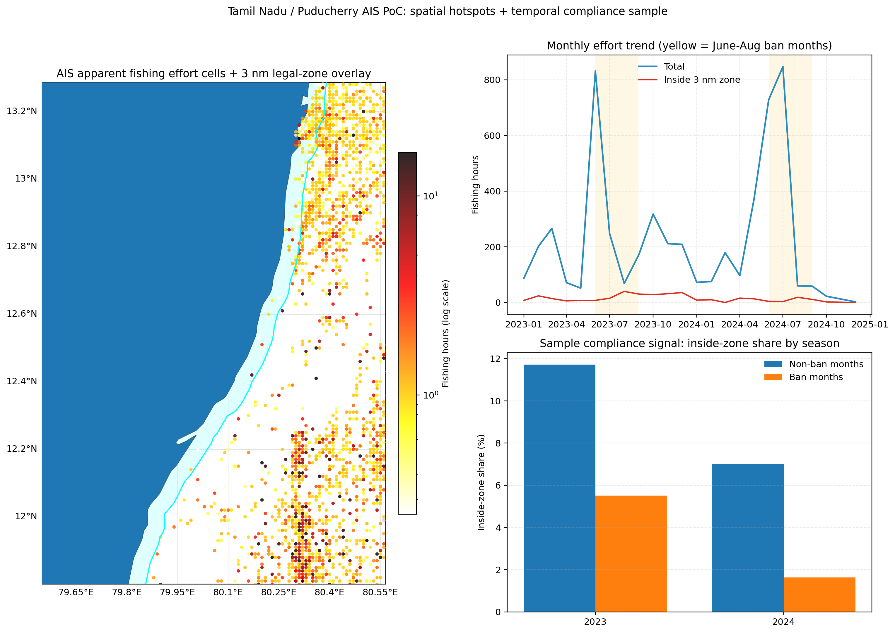

# Tamil Nadu / Puducherry IUU Monitoring PoC

A technical proof-of-concept (PoC) leveraging the [Global Fishing Watch (GFW) 4Wings API](https://globalfishingwatch.org/our-apis/) to analyze apparent fishing effort (AIS) off the Tamil Nadu and Puducherry coast for small-scale fisheries governance (2023–2024).

The primary executable script for this PoC is **`gfw_poc_final.py`**.

## Project Capabilities
1. **AIS Effort Analysis**: Retrieves high-resolution spatial/temporal AIS fishing effort data from GFW across the Tamil Nadu/Puducherry bounding box.
2. **Geospatial Processing**: Computes and overlays the 3-nautical-mile artisanal marine zone using `geopandas` and `cartopy` (buffering coastline in UTM 44N to maintain metric fidelity).
3. **Temporal Compliance Tracking**: Classifies fishing effort inside vs. outside the artisanal zone, providing aggregated metrics and detecting seasonal trends (e.g., assessing the TNMFR Act June-August mechanised fishing ban).

## Reproduce the Analysis

```sh
# 1. Install dependencies
pip install -r requirements.txt

# 2. Configure GFW API token (get one at globalfishingwatch.org/our-apis/tokens)
export GFW_TOKEN="<your-token>"      # Linux/macOS
# $env:GFW_TOKEN="<your-token>"      # PowerShell (Windows)

# 3. Execute the final PoC script
python gfw_poc_final.py
```

### Outputs of `gfw_poc_final.py`
Executing the main script yields the following artifacts in the `output/` directory:



- **`poc_ais_dashboard_tn_puducherry.png`**: Spatial and temporal compliance dashboard (matplotlib).
- **`poc_ais_dashboard_tn_puducherry.html`**: Interactive Folium map with inside/outside effort heat layers.
- **`poc_monthly_summary_tn_puducherry.csv`**: Monthly quantitative summary and inside-zone proportion metrics.
- **`poc_hotspots_in_zone_tn_puducherry.csv`**: Top 25 hotspot coordinates reflecting non-compliant effort inside the 3 nm boundary.

## Additional Context
While this repository focuses on AIS-centric offshore industrial pressure, the broader project scope integrates Sentinel-2 optical data to identify AIS-dark mechanised trawler incursions. 

## License
MIT. GFW data is subject to the [GFW Data Terms of Use](https://globalfishingwatch.org/our-apis/documentation#terms-of-use).
